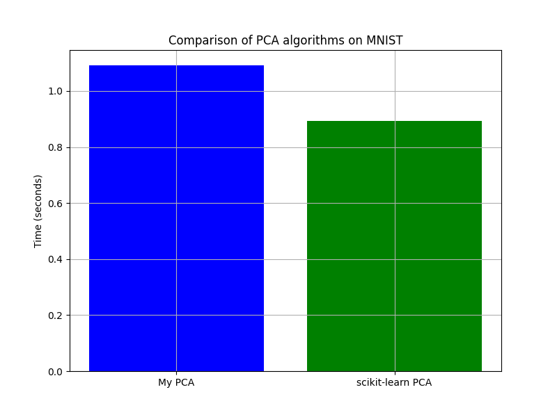
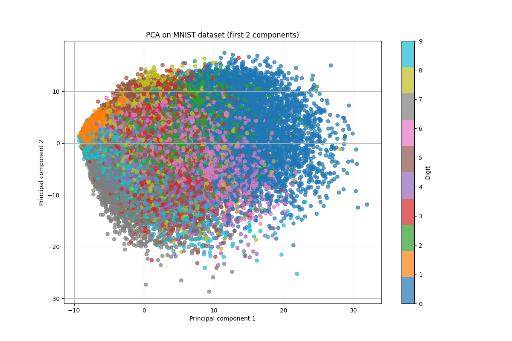
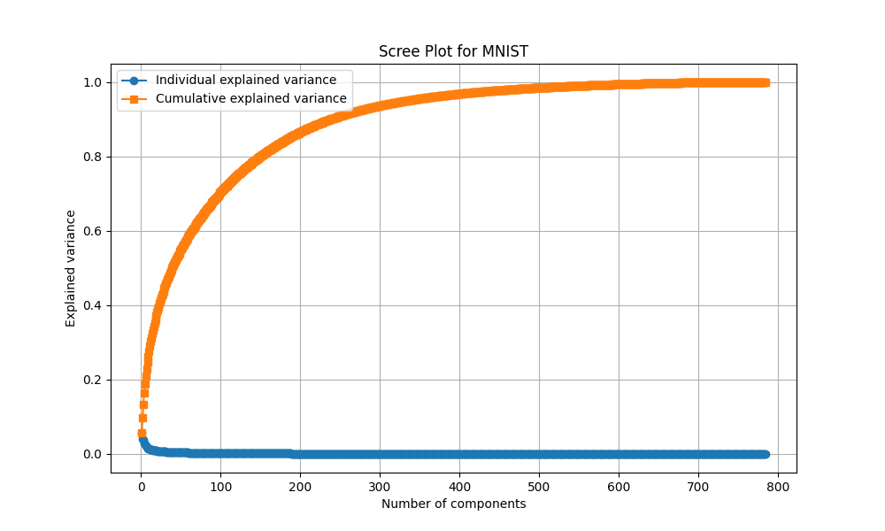

# Алгоритм Головних Компонент на Наборі Даних MNIST

## Зміст
- [Опис проєкту](#опис-проєкту)
- [Дані](#дані)
- [Реалізація PCA](#реалізація-pca)
- [Вибір оптимального значення k](#вибір-оптимального-значення-k)
- [Порівняння з scikit-learn PCA](#порівняння-з-scikit-learn-pca)
- [Візуалізація результатів](#візуалізація-результатів)
  - [Проекція на перші дві головні компоненти](#проекція-на-перші-дві-головні-компоненти)
  - [Кумулятивна пояснена дисперсія](#кумулятивна-пояснена-дисперсія)
- [Висновки](#висновки)
- [Посилання](#посилання)

## Опис проєкту

У цьому проєкті я реалізував алгоритм головних компонент (PCA) для зменшення розмірності набору даних MNIST. Метою було зберегти максимальну кількість інформації при зменшенні розмірності даних, що спрощує подальшу обробку та аналіз.

## Дані

Набір даних **MNIST** містить зображення рукописних цифр з розмірністю 28×28 пікселів (всього 784 ознаки). Дані доступні за посиланням: [http://yann.lecun.com/exdb/mnist/](http://yann.lecun.com/exdb/mnist/). Я використовував:

- **Тренувальний набір**: перші 60,000 прикладів.
- **Тестовий набір**: 10,000 прикладів.

## Реалізація PCA

Алгоритм PCA був реалізований з урахуванням наступних кроків:

1. **Стандартизація даних**: Центрування даних до середнього значення 0.
2. **Обчислення коваріаційної матриці**: Для врахування взаємозв'язків між ознаками.
3. **Власні значення та власні вектори**: Знаходження напрямків найбільшої варіації в даних.
4. **Вибір кількості компонент** `k`: Визначення оптимального числа компонент для збереження максимальної інформації.
5. **Проекція даних**: Перетворення оригінальних даних у новий набір ознак меншої розмірності.

## Вибір оптимального значення `k`

Я обрав значення **`k = 606`**, що пояснює **99.50%** дисперсії даних.

**Аргументація вибору:**

- **Пояснена дисперсія**: Кумулятивна частка поясненої дисперсії при `k = 606` дозволяє зберегти майже всю інформацію.
- **Критерій "ліктя"**: На графіку Scree Plot після 606-ї компоненти спостерігається поступове зменшення власних значень.
- **Обчислювальна ефективність**: Зменшення розмірності з 784 до 606 ознак прискорює подальшу обробку даних.

## Порівняння з scikit-learn PCA

| Метод                | Час виконання (секунди) |
|----------------------|-------------------------|
| **Мій PCA**          | `1.0917`                |
| **Scikit-learn PCA** | `0.8942`                |

- **Максимальна різниця між проекціями**: `4.845746e+02`

*Графік порівняння швидкості виконання алгоритмів PCA.*

Незначна різниця в часі та максимальна різниця між проекціями вказують на схожість результатів двох реалізацій з невеликими відмінностями, обумовленими чисельними методами.

## Візуалізація результатів

### Проекція на перші дві головні компоненти

*Візуалізація даних на площині перших двох головних компонент.*

### Кумулятивна пояснена дисперсія

*Графік кумулятивної частки поясненої дисперсії залежно від числа компонент.*

## Висновки

- **Оптимальне значення `k`**: Вибір `k = 606` є оптимальним для збереження 99.5% інформації при зменшенні розмірності.
- **Теоретичні аспекти**: Власні значення, власні вектори та стандартизація даних є критичними для правильного застосування PCA.
- **Ефективність**: Зменшення розмірності покращує обчислювальну ефективність та спрощує подальший аналіз.

## Посилання

- **MNIST Dataset**: [http://yann.lecun.com/exdb/mnist/](http://yann.lecun.com/exdb/mnist/)
- **Лекційні матеріали**: файл **Algebra.pdf** з Classroom.
